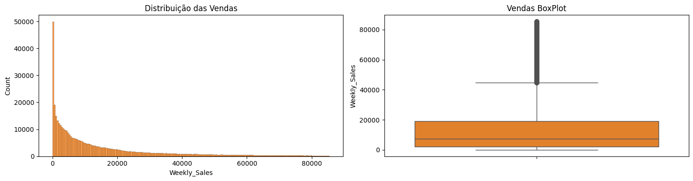
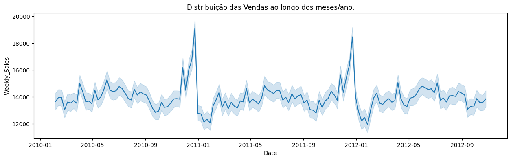
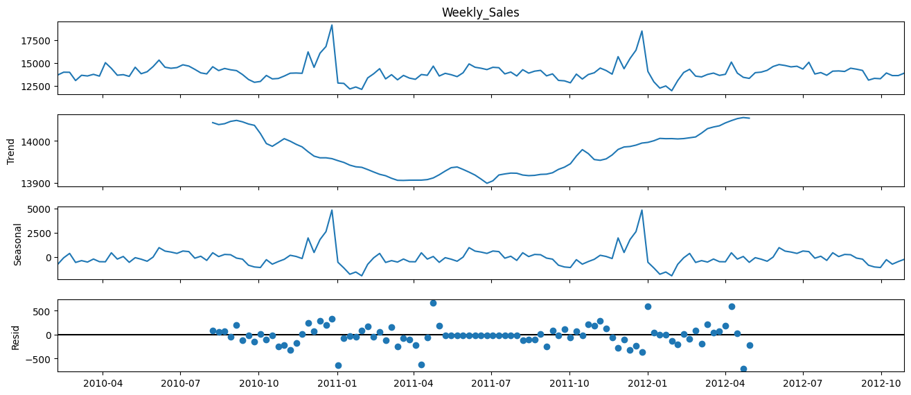
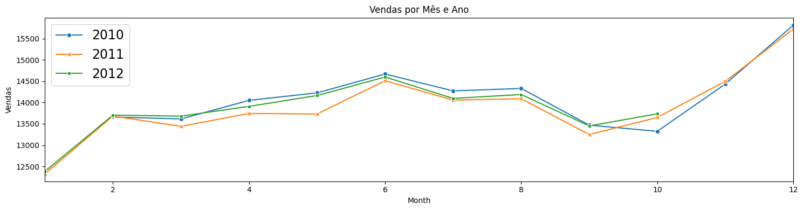
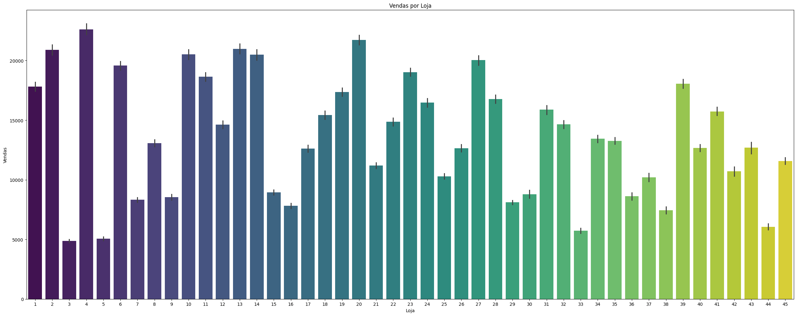
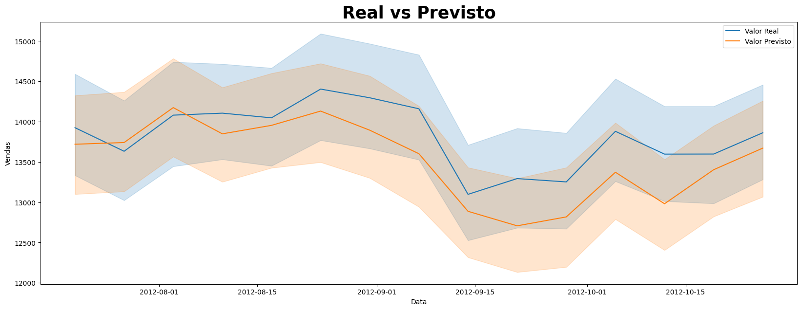
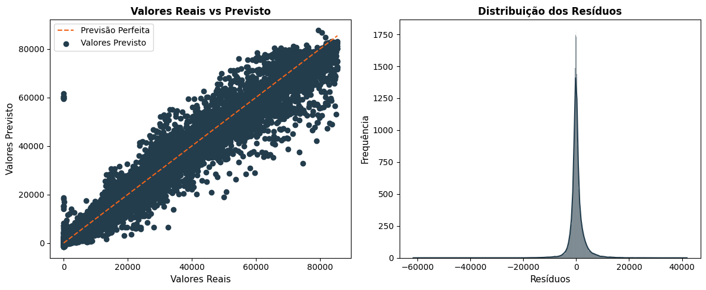
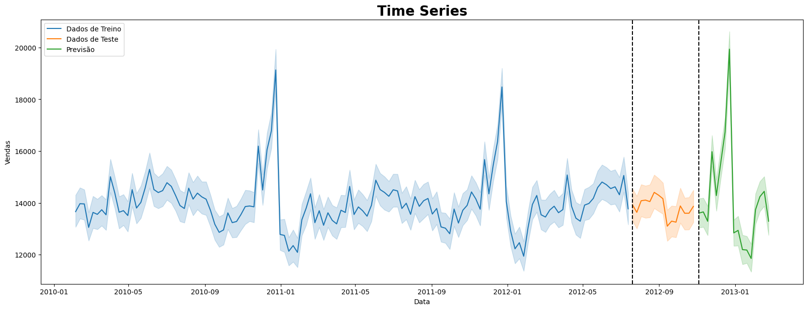
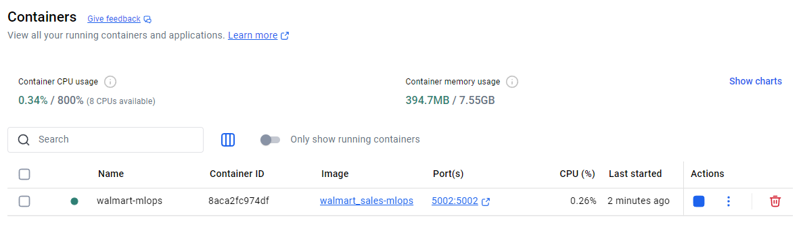
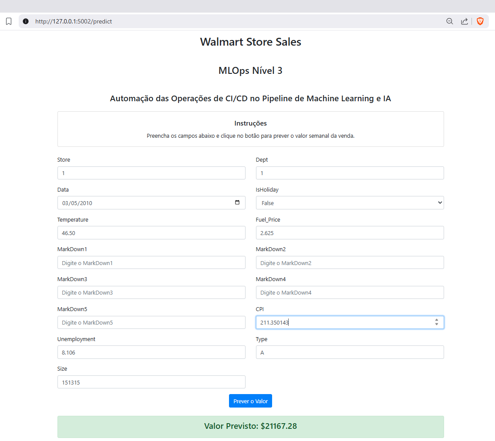

# Walmart Store - MLOps Pipeline 

## Automação das Operações de CI/CD no Pipeline de Machine Learning

**Tópicos do Projeto:**

- Estrutura dos diretórios e arquivos
- Documentação (imagens do passo-a-passo do construção do projeto)
- Instruções para executar o projeto

O projeto tem como objetivo realizar a previsão de vendas para um período de três meses em diversas lojas do Walmart. Para o cliente final, será disponibilizado um aplicativo web desenvolvido com o framework Flask, permitindo que ele insira os dados necessários e visualize a estimativa gerada pelo modelo de Machine Learning para a semana selecionada.

--------------------------

## Estrutura do Projeto
```
│── .github/
│   └── workflows/
│       └── mlops-pipeline.yml    			# Arquivo do GitHub Actions para automação
│
├── artifacts/                    			# Armazena modelos treinados e objetos de pré-processamento
│   ├── optimized_xgboost_model.pkl
│
├── config/                       			# Arquivos de configuração
│   ├── config.yaml               			# Hiperparâmetros de modelo e pré-processamento
│   ├── logging.yaml              			# Configurações de log
│
├── data/                         			# Dados brutos e processados
│   ├── raw/
│   │   ├── train.csv
|   |   ├── stores.csv
|   |   ├── features.csv
│   ├── processed/
│   │   ├── train_data.csv
│   │   ├── test_data.csv
│
├── pipeline/                          	    # Código-fonte para pipeline de ML modularizado
│   ├── __init__.py
│   ├── preprocessa_dados.py     		    # Manipulando valores ausentes, codificação, dimensionamento
│   ├── engenharia_atributos.py    		    # Seleção de recursos, transformação
│   ├── otimiza_hiperparametros.py  	    # Optuna para ajuste de hiperparâmetros
│   ├── avalia_modelo.py         		    # Avaliação de modelo e análise residual
│   ├── salva_artefatos.py         		    # Salvar modelo e artefatos de pré-processamento
│
├── scripts/                      		    # Scripts de automação
│   ├── train.py        	                # Automatiza o pipeline de treinamento
│   ├── predict.py                          # Automatiza o pipeline de inferência (previsões)
│   ├── app_inference.py    			    # Usado para previsões na app
│
├── app/                          			# Deploy do modelo via app web com Flask
│   ├── app.py                    			# Endpoint de inferência
│   ├── templates/
│       └── index.html            			# Página HTML para inputs do usuário
│
├── tests/                        			# Testes unitários para o Pipeline CI/CD
│   ├── test_engenharia_atributos.py
│   ├── test_avalia_modelo.py
│
├── Dockerfile                    			# Dockerfile para criação de container
├── requirements.txt              			# Dependências
├── LEIAME.txt                     			# Documentação do projeto
```

## Documentação do Projeto

**Análise da distribuição da variável venda após a remoção de alguns outliers muito discrepantes.**




**Decomposição da variável vendas para analisar tendência, sazonalidade e o resíduos.**




**Análise das Vendas por Loja**


**Machine Learning - Análise do desempenho do modelo**




**Forecast do Modelo**


**Aplicativo Web rodando em um container Docker**




## Para executar o projeto

### Abra o terminal, navegue até a pasta com os arquivos e execute os comandos abaixo para criar um ambiente virtual:

```bash
conda create --name walmart_sales python=3.12
conda activate walmart_sales
pip install -r requirements.txt 
```

### Comandos para executar o pipeline de ML:

```bash
python scripts/train.py
python scripts/predict.py
pytest -v
python app/app.py
docker build -t walmart_sales-mlops .
docker run -d -p 5002:5002 --name walmart-mlops walmart_sales-mlops
```
